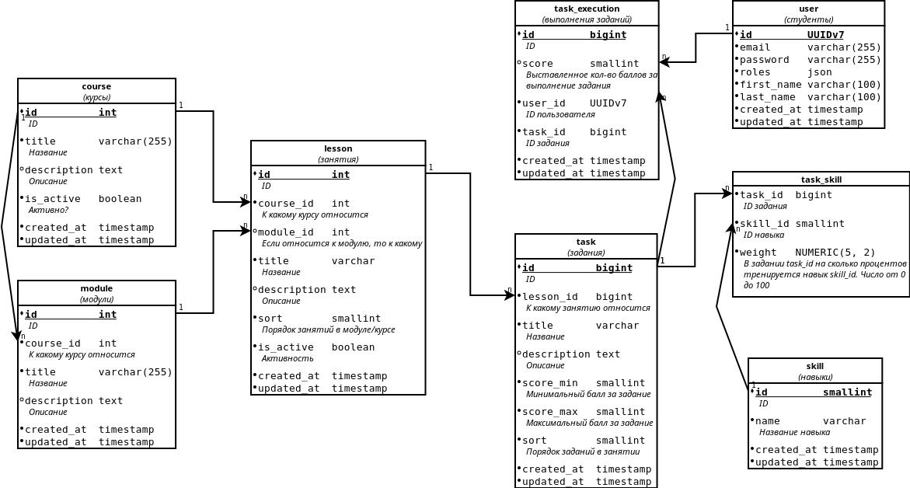

# Сервис хранения прогресса студента

> Презентационный backend-сервис для отслеживания прогресса студентов. Преподаватели выставляют 
> оценки за задания, система асинхронно агрегирует баллы студента (по уроку, модулю и курсу).

---

## Стек

+ **Backend:** PHP 8.3, Symfony 7.3, Doctrine ORM, PostgreSQL 18  
+ **Асинхронность:** Symfony Messenger, RabbitMQ, Supervisor  
+ **Кэш:** Redis  
+ **Frontend:** Vue 3, Bootstrap 5, Axios (CDN, без этапа сборки)  
+ **Безопасность:** JWT (`lexik/jwt-authentication-bundle`), RBAC через Symfony Voters  
+ **Мониторинг и диагностика:** Monolog, Elasticsearch, Kibana, реализовано добавление в логи Request ID для межсервисной трассировки    
+ **Инфраструктура:** Docker Compose, Traefik, GitLab CI/CD, Blue-Green deployment  
+ **Качество кода:** PHPUnit, PHP CS-Fixer, PHPStan

---

## Архитектурные решения

| Подход                     | Детали                                                                                                                                                                        |
|----------------------------|-------------------------------------------------------------------------------------------------------------------------------------------------------------------------------|
| **DDD-слои**               | Domain / Application / Infrastructure / Presentation — зависимости только сверху вниз                                                                                         |
| **Invokable Controllers**  | Один класс = один эндпоинт, `__invoke()`, без наследования `AbstractController`                                                                                               |
| **Repository Pattern**     | Сервисы зависят от интерфейсов; Doctrine-реализации инжектируются через DI                                                                                                    |
| **Event-Driven**           | Выставление оценки публикует событие в брокер. Handler пересчитывает агрегаты                                                                                                 |
| **Агрегированные таблицы** | `AggStudentLesson`, `AggStudentModule`, `AggStudentCourse` денормализация для быстрых read-запросов                                                                           |
| **Redis-кэш**              | Агрегаты кэшируются. Инвалидация происходит через цепочку Messenger-сообщений                                                                                                 |
| **Тестирование**           | Unit (используются моки), Functional (реальная БД, транзакционная изоляция через пакет `dama`), есть пара Acceptance (E2E)                                                    |
| **CI/CD**                  | `git push` в `main` запускает пайплайн. Есть 3 этапа: `test`, `deploy` и ручной `rollback` для быстрого отката. Реализована Blue-Green стратегия переключения (без даунтайма) |

---

## Схема базы данных



---

## Локальная разработка

### Быстрый старт

```bash
make build              # Собираем Docker-образы
make composer_install   # Устанавливаем PHP-зависимости
make up                 # Запускаем сервисы (проверить http://localhost:7777)
```

### Первоначальная настройка

```bash
make console c="lexik:jwt:generate-keypair --overwrite"    # Единоразово генерим JWT-ключи
make migrate                                               # Применяем миграции
make console c="app:fixtures:load --reset"                 # Можно загрузить тестовые данные
```

Предопределённые аккаунты после загрузки фикстур:

| Email                | Пароль        | Роль    |
|----------------------|---------------|---------|
| admin@example.com    | Admin@12345   | admin   |
| teacher1@example.com | Teacher@12345 | teacher |
| student1@example.com | Student@12345 | student |

### Тесты

```bash
make test_db_create     # Создаём базу для тестов
make test               # Все тесты
make test_unit          # Unit-тесты
make test_functional    # Функциональные тесты
```

### Прочее

```bash
make down                                        # Остановка сервисов
make console c="app:fixtures:seed-scores"        # Можно опубликовать выставление 900 рандомных оценок в очередь для разбора хэндлером (запуск агрегации и кэширования)
```
